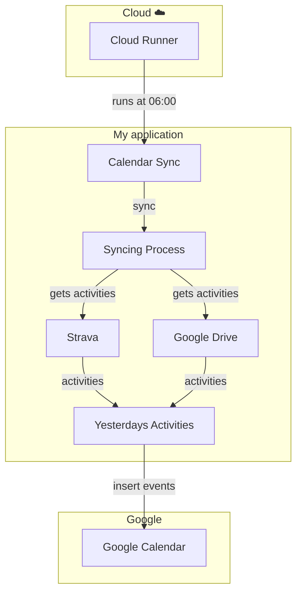
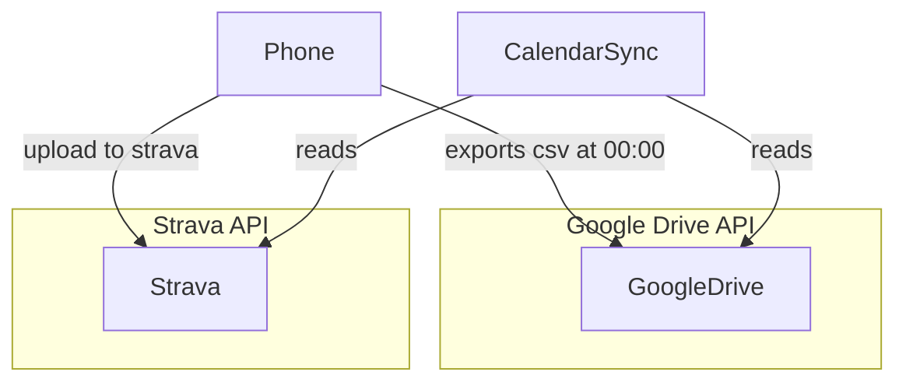

# Sync

```mermaid
flowchart TD

CloudRunner[Cloud Runner]
CalendarSync[Calendar Sync]
Strava[Strava]
GoogleDrive[Google Drive]
GoogleCalendar[Google Calendar]
SyncingProcess[Syncing Process]
YesterdaysActivities[Yesterdays Activities]

CloudRunner -->|runs at 06:00| CalendarSync

CalendarSync -->|sync| SyncingProcess

SyncingProcess -->|gets activities| Strava
SyncingProcess -->|gets activities| GoogleDrive

Strava -->|activities| YesterdaysActivities
GoogleDrive -->|activities| YesterdaysActivities

YesterdaysActivities -->|insert events| GoogleCalendar

subgraph "Cloud ☁️"
CloudRunner
end

subgraph "My application"
CalendarSync
SyncingProcess
GoogleDrive
Strava
YesterdaysActivities
end

subgraph "Google"
GoogleCalendar
end
```

## Sources

```mermaid
flowchart TD

Phone -->|exports csv at 00:00| GoogleDrive
Phone -->|upload to strava| Strava

subgraph "Google Drive API"
GoogleDrive
end

subgraph "Strava API"
Strava
end

CalendarSync -->|reads| GoogleDrive
CalendarSync -->|reads| Strava

```